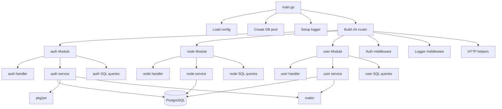

# Backend README

## Architecture Overview

This backend is organized as a modular monolith. The application entry point boots the shared infrastructure once, then composes feature modules such as auth, node, and user. Each module owns its own handler, service, and routing setup, while shared infrastructure stays in the root of `internal`.



## Module Structure

```text
backend/
├── cmd/
│   └── main.go
├── internal/
│   ├── auth/           # feature module
│   ├── config/         # app config
│   ├── db/             # sqlc generated DB layer
│   ├── domain/         # shared domain-level errors/contracts
│   ├── http/
│   │   ├── dto/        # HTTP response models
│   │   ├── httputil/   # request/response helper functions
│   │   ├── middleware/ # auth + logging
│   │   └── validator/  # request validation
│   ├── mailer/         # mailer abstraction
│   ├── node/           # feature module
│   ├── user/           # feature module
│   └── ...
├── pkg/
│   ├── jwt/
│   └── logger/
├── docs/
└── ...
```

## Module Responsibilities

### auth

- registration / login / logout
- token refresh
- forgot/reset password flow
- JWT cookie management

### user

- profile access and updates
- preferences
- password changes
- email verification flow

### node

- create / read / update / delete node entities
- move operations
- children traversal and node tree logic

### shared infrastructure

- config loading
- DB query access
- middleware for auth and logging
- helper utilities for requests, responses, cookies, and token handling

## Request Flow

```text
HTTP request
   ↓
main.go router
   ↓
module.RegisterRoutes()
   ↓
module handler
   ↓
service layer
   ↓
sqlc database queries / repositories
   ↓
response
```

## Tech Stack

- Language: Go
- Web framework: Chi router
- DB: PostgreSQL + pgx + sqlc
- Auth: JWT + secure refresh tokens stored in DB
- Validation: custom request validation layer
- Logging: slog
- Mailer: console mailer / SMTP ready abstraction
- Containerization: Docker + docker-compose

## Runtime Composition

The app boots all dependencies in one place in `cmd/main.go`:

- config
- DB pool
- logger
- router
- middleware
- modules (`auth`, `node`, `user`)

This keeps the project as a modular monolith: independent features are separated by package, but the application still runs as a single deployable service.
